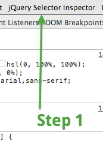
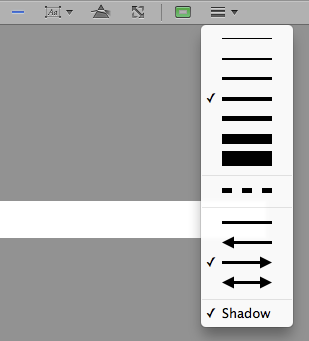
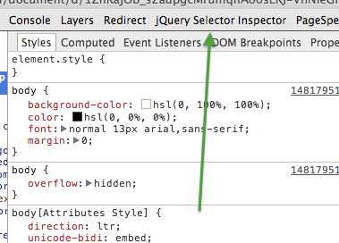
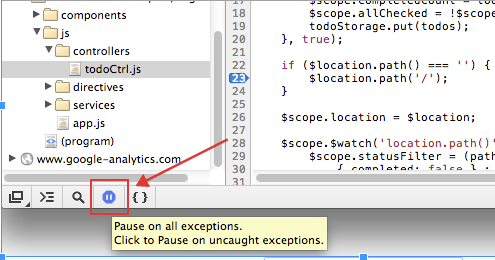
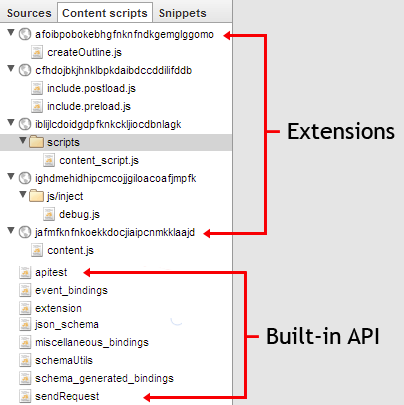
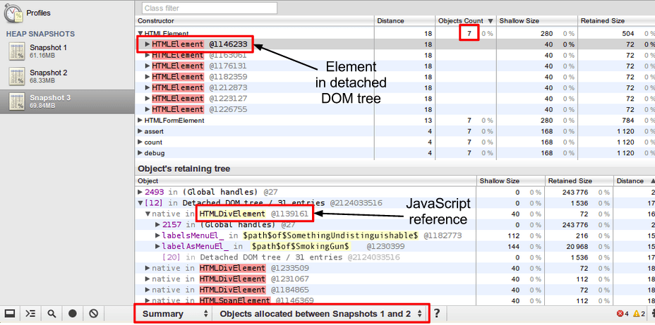
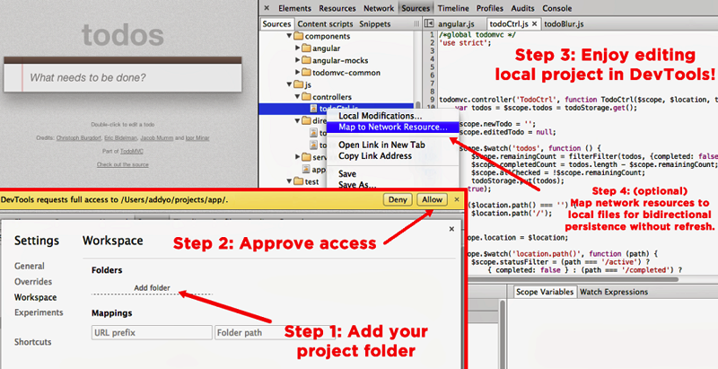
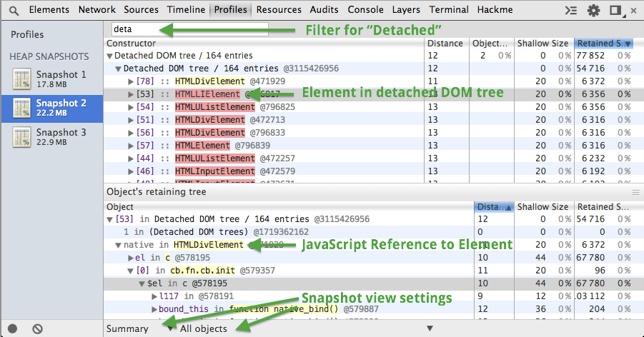
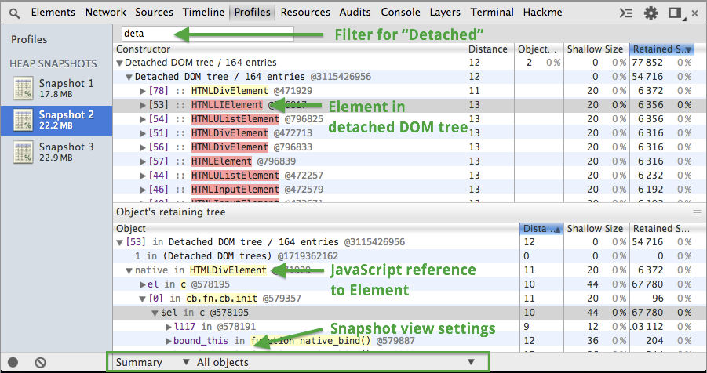
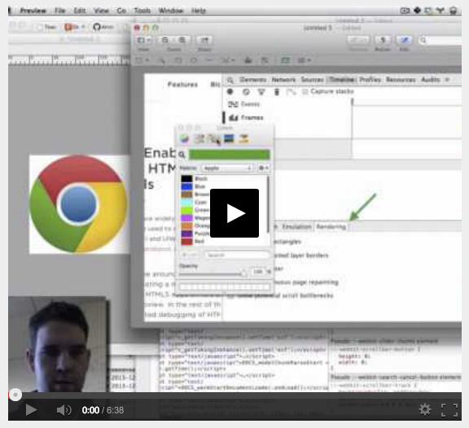

# Conventions for images and callouts
###  …for screenshots and diagrams in our docs

# Images

* We use 2x images for screenshots. Max width is currently 1400px.
* png usually but jpg is often better filesize-wise. compress it.

## Necessary Callout  Styles

* Arrow calling out a piece of UI
    * E.g the Styles pane.
* Rectangle around a piece of text/UI where an arrow is insufficient. 
    * E.g: settings pane. Lots of text. An arrow isn't as useful unless it's 
      small or has a large head to it. Rectangle makes more sense there
    * If only one rectangle is used, should it still have an arrow with a label? 
      or would we prefer to just call out in the text
* Rectangles with accompanying labels.
    * Where you need to point out multiple pieces of small UI, each of which 
      requires a label
    * Alternatives: rectangles with numbers next to them. Reference the numbers 
      in text below the screenshot. Pros: you don't have to worry about editing 
      the text in future revisions of the shot. Easier to update text. 
      Translate. etc.

## Working Callout Style Standard:

* font: 
    * 19px Droid Sans
    * [fontsquirrel.com/fonts/Droid-Sans](http://www.fontsquirrel.com/fonts/Droid-Sans) 
        (can download TTF here. Install the bold, too)
    *  ← sans    
* line thickness, style
    *  
        * Above is ideal thickness and arrow head size.
        * Shadow added generally improves the annotation.
* color:  
    * Green!  Somewhere around **\#409B44** or **rgb(64,155,68)**
    * 
    * Chrome green: 
* arrow vs rectangle:
    *  **Both**! But **preferring Arrow **when there's a choice.
    * **Arrows** are effective at quickly drawing attention to certain focal 
      points of the image. When there's a choice, use them.
        * An example showing both arrow and rectangle. Arrow-only would be very 
          effective here.
        * 
    * There will be cases where the focal point will be a large area and the 
      best way to draw attention to it use to highlight the whole thing. A 
      **rectangle** may be appropriate here. 
        * This example would be have done more effectively with two rectangles:
        * 
    * Still, a complex UI may require **both** annotation symbols. The following 
      example would be difficult to do without using both:
        * 
* Using text outside UI screenshot vs. inside it
    * Ideal to not overlap annotation text over existing UI text. Find some 
      whitespace!
        * This may stay within the UI or go outside.
* Use of text in image.
    * While in-image text annotation is very useful, do make sure that the text 
      outside the image also captures what is being said in the image. This 
      makes sure that the Cons listed below do not hurt the accessibility of the 
      content. 
    * For example,  Addy's classic red, 4-step workspaces image. We shouldn't 
      put that in the docs without having document text that explains the same 
      steps.
    * 
    * **Cons**
        * Breaks Cmd+F
        * Breaks screenreaders, and SEO
        * Raster, doesn't scale/zoom as well.
        * Maintenance burden.
    * **Pros** 
        * Visual focus stays in one place to absorb the value of the image. Less 
          back 'n forth.
* Workflow
    *  If the screenshot shows a workflow (step 1,2,3) or (evaluation -&gt; 
      result) then try to indicate the progression.
    * Directions:
        * Top to bottom
        * Top/left to bottom/right
    * Ya know… if possible.

## Example using above standards:

Repeated but with rectangle for bottom callout, and text not overlapping 
(better!):  

## Video of how this workflow works:

### TL;DW:   

* set up view to best showcase and communicate the UI
* cmd-ctrl-shift-4
* open Preview.app
* cmd-n to paste as new Image
* add any necessary annotations following above standards
* Save as PNG (likely. JPG if photo-heavy)
