{{+bindTo:partials.standard_devtools_article canonical:strings.canonicalDevToolsCommandLine}}

  <strong style="font-weight: normal; font-size: 110%; display:block;">The DevTools docs have moved!</strong>
  <a href="https://developers.google.com/web/tools/javascript/command-line">Read the latest version</a> of this article and <a href="https://developers.google.com/web/tools/chrome-devtools">head over to the new home of Chrome DevTools</a> for the latest tutorials, docs and updates.

# Command Line API Reference

The Command Line API is a collection of functions for performing common tasks with the Chrome Developer Tools. These include convenience functions for selecting and inspecting elements in the DOM, stopping and starting the profiler, and monitoring DOM events. This API complements the [Console API](console-api.md), the Command Line API is only available from within the console itself.

## $_ ##

Returns the value of the most recently evaluated expression. In the following example, a simple expression is evaluated. The `$_` property is then evaluated, which contains the same value:

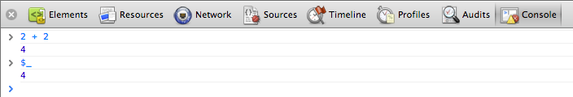

In the next example, the evaluated expression is a call to the [`$$()`](#selector_1) method, which returns an array of elements that match the CSS selector. It then evaluates `$_.length` to get the length of the array (17), which becomes the most recently evaluated expression.

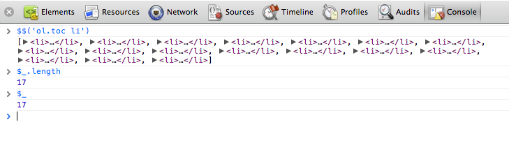

## $0 - $4 ##

Dev Tools remembers the last five DOM elements (or JavaScript heap objects) that you've selected in the  tab (or Profiles panel). It makes those objects available as **`$0`**, **`$1`**, **`$2`**, **`$3`**, and **`$4`**. **`$0`** returns the most recently selected element or JavaScript object, **`$1`** returns the second most recently selected one, and so on.

In the following example, an element with the ID `gc-sidebar` is selected in the Elements tab. In the Console window `$0` has been evaluated, which displays the same element.

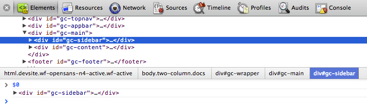

The image below shows the `gc-content` element selected in the same page. The **`$0`** now refers to newly selected element, while **`$1`** now returns the previously selected one (`gc-sidebar`).

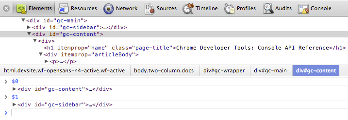

## $(selector) ##

Returns reference to the first DOM element with the specified CSS selector.This function is an alias for [`document.querySelector()`](http://docs.webplatform.org/wiki/css/selectors_api/querySelector) function.

The following example saves a reference to the first `` element in the document and calls displays its `src` property:

    $('img').src;

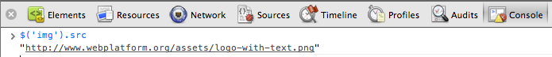

## $$(selector) ##

Returns an array of elements that match the given CSS selector. This command is equivalent to calling [`document.querySelectorAll()`](http://docs.webplatform.org/wiki/css/selectors_api/querySelectorAll).

The following example uses `$$()` to create an array of all `` elements in the current document and displays the value of each element's `src` property.

    var images = $$('img');
    for (each in images) {
        images[each].src;
    }

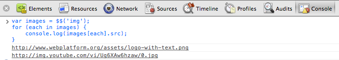

Note: Press Shift+Enter in the console to start a new line without executing the script.

## $x(path) ##

Returns an array of DOM elements that match the given XPath expression. For example, the following returns all the `
` elements that contain `<a>` elements:

    $x("//p[a]")

## clear() ##

Clears the console of its history.

    clear();

Also see [Clearing the console](console.md#clearing-the-console-history).

## copy(object) ##

Copies a string representation of the specified object to the clipboard.

    copy($0);

## debug(function)

When the function specified is called, the debugger will be invoked and will break inside the function on the Sources panel allowing you to be able to step through the code and debug it.

    debug(getData);

Use [undebug(fn)](#undebugfunction) to stop breaking on the function, or use the UI to disable all breakpoints.

## dir(object)

Displays an object-style listing of all the properties of the specified object. This method is an alias for the Console API's [`console.dir()`](console-api#consoledirobject) method.

The following example shows the difference between evaluating `document.body` directly in the command line, and using `dir()` to display the same element.

    document.body;
    dir(document.body);

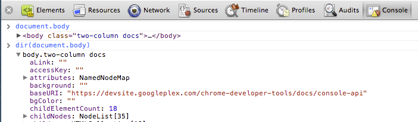

For more information, see the [`console.dir()`](console-api#consoledirobject) entry in the Console API.

## dirxml(object)

Prints an XML representation of the specified object, as seen in the Elements tab. This method is equivalent to the [`console.dirxml()`](console-api#consoledirxmlobject) method.

## inspect(object/function)

Opens and selects the specified element or object in the appropriate panel: either the Elements panel for DOM elements and the Profiles panel for JavaScript heap objects.

The following example opens the first child element of `document.body` in the Elements panel:

    inspect(document.body.firstChild);

When passing a function to inspect, when the function is called it will open it up in the Sources panel for you to inspect.

## getEventListeners(object) ##

Returns the event listeners registered on the specified object. The return value is an object that contains an array for each registered event type ("click" or "keydown", for example). The members of each array are objects that describe the listener registered for each type. For example, the following lists all the event listeners registered on the `document` object.

    getEventListeners(document);

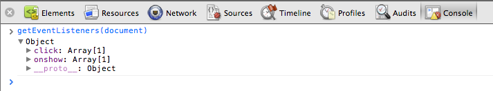

If more than one listener is registered on the specified object, then the array contains a member for each listener. For instance, in the following example there are two event listeners registered on the `#scrollingList` element for the "mousedown" event:

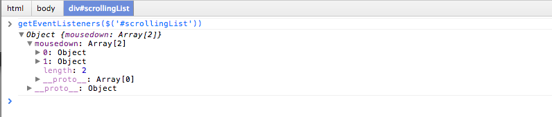

You can further expand each of these objects to explore their properties:

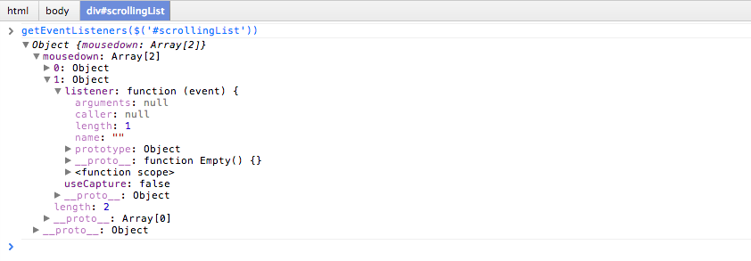

## keys(object)

Returns an array containing the names of the properties belonging to the specified object. To get the associated values of the same properties, use [values()](#valuesobject).

For example, suppose your application defined the following object:

    var player1 = {
        "name": "Ted",
        "level": 42
    }

Assuming `player1` was defined in the global namespace (for simplicity), typing `keys(player1)` and `values(player1)` in the Console would result in the following:

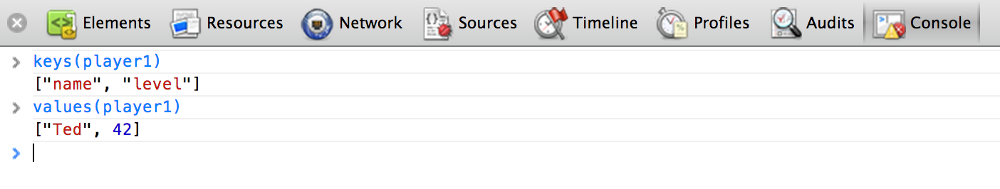

## monitor(function)

When the function specified is called, a message is logged to the console that indicates the function name along with the arguments that are passed to the function when it was called.

    function sum(x, y) {
        return x + y;
    }
    monitor(sum);

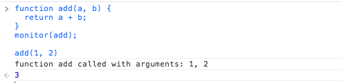

Use [unmonitor(function)](#unmonitorfunction) to cease monitoring.

## monitorEvents(object[, events])

When one of the specified events occurs on the specified object, the Event object is logged to the console. You can specify a single event to monitor, an array of events, or one of the generic events "types" that are mapped to a predefined collection of events. See examples below.

The following monitors all `resize` events on the `window` object.

    monitorEvents(window, "resize");

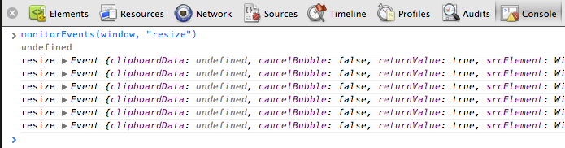

The following defines an array to monitor both "resize" and "scroll" events on the `window` object:

    monitorEvents(window, ["resize", "scroll"])

You can also specify one of the available event "types", strings that map to predefined sets of events. The table below lists the available event types and their associated event mappings:

|Event type|Corresponding mapped events
-----|---------------
**mouse**| "`click`", "`dblclick`", "`mousedown`", "`mouseeenter`", "`mouseleave`", "`mousemove`", "`mouseout`", "`mouseover`", "`mouseup`", "`mouseleave`", "`mousewheel`"
**key** | "`keydown`", "`keyup`", "`keypress`", "`textInput`"
**touch** | "`touchstart`", "`touchmove`", "`touchend`", "`touchcancel`"
**control**| "`resize`", "`scroll`", "`zoom`", "`focus`", "`blur`", "`select`", "`change`", "`submit`", "`reset`"

For example, the following uses the "key" event type all corresponding key events on an input text field ("`#msg`").

    monitorEvents($("#msg"), "key");

Below is sample output after typing two characters in the text field:

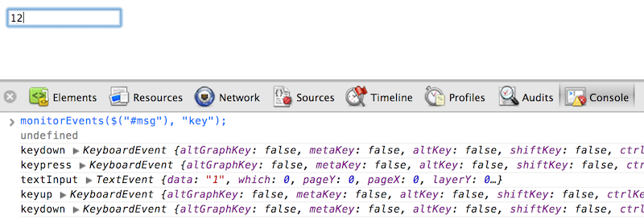

## profile([name])

Starts a JavaScript CPU profiling session with an optional name. To complete the profile call [`profileEnd()`](#profileendname).

To start profiling:

    profile("My profile")

To stop profiling and display the results in the Profiles panel:

    profileEnd("My profile")

Profiles can also be nested. For example, this will work in any order:

    profile('A');
    profile('B');
    profileEnd('A');
    profileEnd('B');

For more examples, see [Controlling the CPU profiler](console.md#controlling-the-cpu-profiler).

## profileEnd([name])

Stops the current profiling session started with the [profile()](#profilename) method and displays the results in the Profiles panel.

## table(data[, columns])

Log object data with table by passing in a data object in with optional column headings. For example, to display a list of names using a table in the console you would do:

    var names = {
        0: { firstName: "John", lastName: "Smith" },
        1: { firstName: "Jane", lastName: "Doe" }
    };

    table(names);

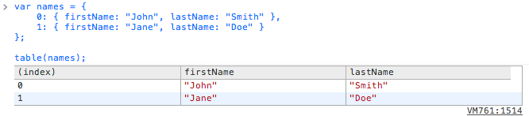

## undebug(function)

Stops the debugging of the specified function so that when the function is called the debugger will no longer be invoked.

    undebug(getData);

## unmonitor(function)

Stops the monitoring of the specified function. Used in concert with [monitor(fn)](#monitorfunction).

    unmonitor(getData);

## unmonitorEvents(object[, events])

Stops monitoring events for the specified object and events. For example, the following stops all event monitoring on the `window` object:

    unmonitorEvents(window);

You can also selectively stop monitoring specific events on an object. For example, following code starts monitoring all mouse events on the currently selected element, and then stops monitoring "mousemove" events (perhaps to reduce noise in the console output).

    monitorEvents($0, "mouse");
    unmonitorEvents($0, "mousemove");

Also see [Monitoring events](console.md#monitoring-events).

## values(object)

Returns an array containing the values of all properties belonging to the specified object.

    values(object);

## Additional APIs

Chrome extensions can inject additional helper methods into the commandline API. For example, the [Debug Utils extension](https://chrome.google.com/webstore/detail/debug-utils/djailkkojeahmihdpcelmmobkpepmkcl) ([github](https://github.com/amasad/debug_utils))  offers hooks for breaking on property access, event firings, and method calls.

{{/partials.standard_devtools_article}}
