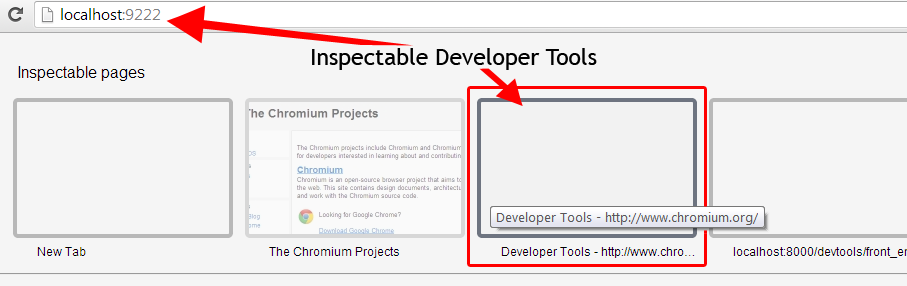
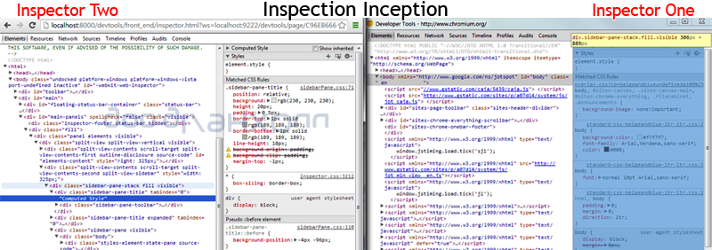

{{+bindTo:partials.standard_devtools_article}}

This guide is valuable, but it represents the 2014-ish pre-Blink/Chromium merge view of things.

### Step 1: Getting set up

There are a few things you need in order to contribute to DevTools.

**Get the code**

Clone the chromium repo

**Install Tip of Tree Chromium** 

Download [the latest Chromium build](https://download-chromium.appspot.com/).

**Serve devtools frontend**

Run a local web server. The local web server will serve files from the directory
`WebKit/Source/devtools` on some port (e.g. `8000`).

Go to the `devtools` folder:

    cd /src/third_party/WebKit/Source/devtools

From there you can run a local server on port 8000 with the following command:

    python -m SimpleHTTPServer

Then, open `http://localhost:8000/front_end/inspector.html` in your favorite browser and start debugging!

**Why does the server need to run from the devtools directory?**

When remotely debugging and developing the front-end of Blink, the content of the
`InspectorBackendCommands.js` file is generated based on the content of
`protocol.json` instead as a fallback of the Chromium build system. The
`protocol.json` file is in the parent folder of the `front_end` folder which is
`/devtools`. This is why you need to run the web server from within the `devtools` directory.

If your feature requires changes to the back-end code then you definitely need to checkout and build Chromium. Otherwise, you only need to setup a web server for the front-end files and run Chrome with remote-debugging options.

<strong>Note:</strong> `protocol.json` describes the API between front-end and back-end. It is used for generating API stubs for the front-end and back-end at the build stage. When remote debugging the front-end part of the API, <code>InspectorBackendCommands.js</code> is generated on the fly by front-end code. For more information, read the <a href="http://www.chromium.org/developers/how-tos">Chromium How-tos</a>.

### Step 2: Running an edge-build of Chromium

To begin, get an [edge-build](http://www.chromium.org/getting-involved/download-chromium) of Chromium. These are available for all platforms.

There are a couple of [command line flags](http://www.chromium.org/developers/how-tos/run-chromium-with-flags) (or switches) that are needed when running Chromium for developing DevTools.

From [Running Canary with flags](http://www.chromium.org/developers/how-tos/run-chromium-with-flags):

**On Windows**

1. **Right-click** on your "Google Chrome Canary" icon
2. Select  **Properties**, and command line flags to the end of the **Target field**

For example:

    "C:\Users\%username%\AppData\Local\Google\Chrome SxS\Application\chrome.exe" --remote-debugging-port=9222 --no-first-run --user-data-dir=C:\Users\%username%\chrome-dev-profile http://localhost:9222#http://localhost:8000/front_end/inspector.html

**On OS X**

Run Canary in the terminal with the flags added at the end of the path to the program.

    /Applications/Google\ Chrome\ Canary.app/Contents/MacOS/Google\ Chrome\ Canary --remote-debugging-port=9222 --no-first-run --user-data-dir=~/temp/chrome-dev-profile http://localhost:9222#http://localhost:8000/front_end/inspector.html

<strong>Note:</strong> You will need to escape any spaces in the path with a slash "\ " as shown in above.

**On Linux**

Run the chromium-browser command with the flags added after it:

    chromium-browser --remote-debugging-port=9222 --no-first-run --user-data-dir=~/temp/chrome-dev-profile http://localhost:9222#http://localhost:8000/front_end/inspector.html

**What do these switches do?**

* `--user-data-dir=~/temp/chrome-dev-profile` 
  This specifies where the browser will look for all of its state. This can be a relative path to the directory that you're running the web server from. This can point anywhere. You can wipe out your profile at any time.
* `--remote-debugging-port=9222` 
  Enables remote debug over HTTP on the specified port. This is the port used when running localhost.
* `--no-first-run` 
  Skip First Run tasks, whether or not it's actually the First Run.
* `http://localhost:9222#http://localhost:8000/front_end/inspector.html` 
  We're loading our inspection dashboard on port 9222 but we're specifying the devtools frontend to then use in the URL hash: `http://localhost:9222#<front_end url>`.  Since we launched the devtools frontend on port 8000 we want to match that here. The path should point to the correct location of the inspector.html file assuming that
  your web server is running from the Source directory. The older `--remote-debugging-frontend` flag was retired.

These flags cause Chrome to allow websocket connections into localhost:9222 and to serve the front-end UI from your local git repo. Here's a [full list of command line switches](http://peter.sh/experiments/chromium-command-line-switches/) and what they do.

### Step 3: Inspector inception

If you're not developing the DevTools, the easy way to inspect the DevTools is undock them from your tab  so it is in a separate window. Then hit your keyboard shortcut for inspecting (like cmd-alt-i). This will bring up a new DevTools window that's inspecting the previous once. You can now redock these windows as you wish. 

Once Canary is up, open a new tab and navigate to any web page, like `chromium.org`.  

Next, return to the "Inspectable Pages" tab, [http://localhost:9222](http://localhost:9222).

Here you will see a grid menu of every open page that can be inspected. Refresh to update it.

This grid menu is served by a small web server running inside the first instance of Canary which the `--remote-debugging-port=9222` parameter was passed into. Since the web server is running from your local git repo in the
`/blink/Source/devtools` directory, so the files within the devtools folder will be used for the inspector you see when clicking any of one these pages.

Clicking on the thumbnail of the tab you opened. You'll then have a full tab of DevTools that's inspecting your other tab.

Nice job, so far!

Notice that the URL address of this DevTools instance points to [http://localhost:8000/front_end/inspector.html](http://localhost:8000/front_end/inspector.html). This is because of the inspector URL `http://localhost:9222#http://localhost:8000/front_end/inspector.html` that was passed as a hash to the "Inspectable Pages" URL. It connects to your local repo through a websocket, which you may notice, is part of the URL
`?ws=localhost:9222/devtools/`. (You can also use DevTools to look at this WebSocket frame data). Back to hacking…

Now, use your keyboard shortcut to open DevTools within this window. You now have achieved inspector inception.

Well done. Now you can [start contributing](http://dev.chromium.org/developers/contributing-code) and developing the DevTools front-end code located in the directory
`/blink/Source/devtools/front_end`.

### Step 4: Pick a ticket

Now that you are ready to dig into the code and start developing the DevTools source, head over to [http://crbug.com](http://crbug.com) and find the ticket for your change and leave a comment saying you will be writing a patch for it. If you haven't decided on what you to change look through the open issues and choose one you would like to do and leave a comment on it asking for it to be assigned to you.

Alternatively, if there is no existing ticket for the change, then [create a new issue](http://chromiumbugs.appspot.com/?token=3LKZrfbEU7e_Zxic4HVH3gTdvS4%3A1371938055157&role=&continue=https%3A//code.google.com/p/chromium/issues/entry.do). Be sure to describe what the change is and justify why it was needed, adding
"patch to follow" to the end.

**Communicate**

Before you start [contributing](http://dev.chromium.org/developers/contributing-code) on a ticket, it's a good idea to open a new thread on the [DevTools Google Group](https://groups.google.com/forum/?fromgroups#!forum/google-chrome-developer-tools) so you can discuss anything you are unsure of or may not know about regarding the particular ticket you will be working on. You can never over communicate.

### Step 5: Pull, Develop, Branch, Commit

 You may also find it helpful to read the [Chromium guide for contributing code](http://dev.chromium.org/developers/contributing-code).

Pull the latest files from the repository and sync to be sure you are working with the latest code.

    git pull --rebase

Then create a new branch which you can make your changes on.

    git checkout -b yourBugOrFeatureName

Open the DevTools on your DevTools, open your favorite code editor and start digging through the files in your local repository directory `/blink/Source/devtools/front_end`.

<strong>Note:</strong> During development use the Refresh icon or Alt + R instead of F5, Ctrl + R or Cmd + R as they are bound to refresh the host page which you are using to develop the DevTools instance.

Run your change against the Closure Compiler with:

`./devtools/scripts/compile_frontend.py`

You should see "0 error(s), 0 warning(s)".

**Your code:**

1. Should conform to the [Blink Coding Style Guidelines](http://dev.chromium.org/blink/coding-style)
2. Be [tested](http://www.chromium.org/developers/testing/webkit-layout-tests) if appropriate
3. Should pass the closure compiler tests
4. Should be a reasonable size to review (larger patches take longer)

Once you have made your change, commit it. In your commit message include the ticket number and specify that it's a DevTools patch.

    git commit -m "#175024 DevTools: This describes the Goat Teleporter"

It is a good idea to pull down any changes that have been added since you last did one and merge them with your branch.

Once everything for your patch is complete, you will want to write and run relevant layout tests. To get started with layout tests for the DevTools see the
[WebKit layout tests](http://www.chromium.org/developers/testing/webkit-layout-tests) guide.

<strong>Note:</strong> If your patch includes changes that require writing new unit tests or UI tests, they will need to be created and included as part of the patch.

### Step 6: Upload your Patch

 You will need to sign and submit a completed [CLA (Contributor License Agreement)](https://developers.google.com/open-source/cla/individual) before we are able to consider any contributions you may wish to make.

**Uploading the patch for review**

If your patch is finished and all tests pass, upload your changes:

    git cl upload

You may add `--bypass-hooks` to the command to avoid the presubmit tests like closure compiler.

The first time you have to write the patch description and mention issue number, for example "`BUG=231904`". You will be asked for patch description later on and they all will be attached to the same codereview issue. See "Patch Set #1", "PatchSet #2"... at [https://chromiumcodereview.appspot.com/14329024/](https://chromiumcodereview.appspot.com/14329024/)

Explain the change in much detail as you like. Save and exit the editor to finalize the patch submission.

You must have an account for [codereview.chromium.org](https://codereview.chromium.org) and you'll enter in your credentials in this process. Afterwards, you'll get the codereview URL e.g.

    Issue created. URL: https://codereview.chromium.org/18173008".

Take note of this URL, you can go to the page and view the status of it.

* Add reviewers to the changelist and ask them to review. You should pick reviewers from the OWNERS files. `git cl upload` suggests reviewers.
* Now you just have to wait for your friendly neighborhood reviewers to check things out to make sure it's all good.
* Receive comments from reviewers, argue if needed.
* If received LGTM from owners - press commit button.
* Otherwise, fix comments in local checkout in that branch and `git cl upload` again to provide an updated patch.
* While waiting for comments you can switch to another branch and work on a fix for another issue while this one is "frozen", waiting for review.

**Cleanup**

Go back to master branch.

`git checkout master`  

### Running Layout tests

To setup a build that can run the layout tests read about [layout tests](http://www.chromium.org/developers/testing/webkit-layout-tests) over on Chromium.org. Depending on the type of patch you are submitting, there may be Chrome DevTools layout tests you will want to run before submission.

First, run `gclient` to use `git`. You can follow the steps located in the Chromium [Using Git guide](https://code.google.com/p/chromium/wiki/UsingGit) to walk you through this process. In summary, make sure depot_tools is in your path. Run `fetch blink --nosvn=True` in a directory you wish to store the Chromium source (perhaps get a snack or one of those paddles with a ball on it, this will take some time).

When this has finished you can speed up the build process by building the content shell.

On a Mac or Linux machine you can simply run:

`ninja -C out/Debug content_shell`

If you have problems with this step you can look at [Clang](https://code.google.com/p/chromium/wiki/Clang) for Mac help and the [Linux build instructions](https://code.google.com/p/chromium/wiki/LinuxBuildInstructions) for Linux help.

This will also take some time. Once it has finished providing you with warmth from your laptop then you are good to run the layout tests which can be run with from your src directory
`blink/tools/run_layout_tests.sh`. Replace the .sh with .bat if you are on Windows. Some failures are expected! (unfortunately). A good process here is to run them before you make any changes, then run them after you make your changes. It can also take an argument to a directory so you can just point it to the `LayoutTests/inspector` directory to run.

### Frequently Asked Questions

*What is the architecture?*

 DevTools front-end and core/inspector backend use wire protocol (aka remote debugging protocol) to interact. Some older docs (2012) about it:

* [https://www.webkit.org/blog/1875/announcing-remote-debugging-protocol-v1-0/](https://www.webkit.org/blog/1875/announcing-remote-debugging-protocol-v1-0/)
* [https://developer.chrome.com/devtools/docs/debugger-protocol](https://developer.chrome.com/devtools/docs/debugger-protocol)

All the code that touches DOM and other properties of the page is native. Console the only thing that touches the running page JS because it absolutely needs to.

*When adding a new feature where should it be implemented?*

If it depends on renderer information, you should add a new method into the protocol (protocol.json), for example into the DOM agent. That would generate JS bindings on the front-end part and corresponding handler functions in InspectorDOMAgent interface. Then you implement them on the backend part and call from the front-end.

Look at any methods in [protocol.json](https://code.google.com/p/chromium/codesearch#chromium/src/third_party/WebKit/Source/devtools/protocol.json&q=file:protocol.json&sq=package:chromium&type=cs) to see how they are used.

{{/partials.standard_devtools_article}}
