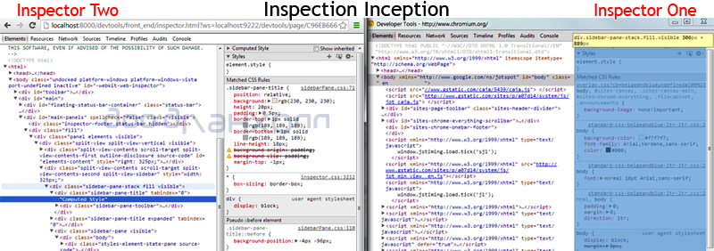

{{+bindTo:partials.standard_devtools_article}}

# Contributing to Chrome DevTools

There are many ways you can improve the productivity of your fellow developers. That could be by sharing what you know or helping out with documenting features or writing a patch to improve the tools we all use.

## How can you help?

Aside from contributing to the source code for DevTools, all of the following are different ways you could help contribute:

* **Documentation authoring**
    * The [source](https://github.com/GoogleChrome/devtools-docs) for the DevTools documentation is on GitHub and contributions are always welcome. Both reference and tutorial guides benefit from your help.
    * Get in touch with [@paul_irish](http://twitter.com/paul_irish) for more information on how you can assist here.
* **Share what you've learned**
    * Share what you've learned via GIFs, Vines or construction paper
    * Cover new experimental features
    * Design improved UX for all parts of DevTools
    * Triage and manage issues
    * Work on features or bugs
* **Coverage of new experimental features**
    * Subscribe to [devtools-reviews@chromium.org mailing list](https://groups.google.com/a/chromium.org/forum/#!forum/devtools-reviews)
      for all reviews of pending code
    * Subscribe to the [RSS feed of devtools commits](http://commits.peter.sh/feed/?tracker=devtools).
    * Follow [@ChromeDevTools](http://twitter.com/ChromeDevTools) on Twitter which also includes a feed of all commits.
    * There's plenty of action and developers are eager to hear what's landing
* **Designing improved UX for all parts of DevTools**
    * Your ideas on the design and UX are quite welcome.
* **Issue triage & management**
    * View [all open DevTools tickets](http://goo.gl/N6OH9). Ask for reductions
      when appropriate or provide them yourself.
* **Working on features or bugs**
    * The codebase is just JavaScript and the contribution guide below can get
      you started quickly

## Keeping up-to-date

The DevTools team values feedback from developers using the tools. If you want to keep updated, you can [subscribe at crbug](https://code.google.com/p/chromium/issues/subscriptions) to the channels below. Please remember to star issues that affect you as well. Finally, don't forget to submit feature requests or bug reports for things that you find as well. Not only in the DevTools, but for all of Chrome.

<textarea readonly>Cr-Platform-DevTools Cr-Platform-DevTools-HTML Cr-Platform-DevTools-Memory Cr-Platform-DevTools-Mobile Cr-Platform-DevTools-Performance Cr-Platform-DevTools-UX</textarea>

## Contributing to DevTools source code

The Chrome DevTools are actually a web app written in JavaScript and CSS. If you're familiar with these technologies, you know enough to write a patch. A few folks have already done this, giving us a colorpicker, a file picker and other features, all contributed by developers just like you.

IRC channel on [Freenode](http://webchat.freenode.net/?channels=blink): #chrome-devtools and #blink

In this guide, we'll cover how to get set up and running locally so you can start developing and contributing to the DevTools. You may also find it helpful to read the [Chromium guide for contributing code](http://dev.chromium.org/developers/contributing-code).

<strong>Note:</strong> You will need to sign and submit a completed <a href="https://developers.google.com/open-source/cla/individual">CLA (Contributor License Agreement)</a> before we are able to consider any contributions you may wish to make.

### Step 1: Getting set up

There are a few things you need in order to contribute to DevTools.

**Get the code**

Download the [Blink](http://www.chromium.org/blink) source code by [cloning the git repository](https://chromium.googlesource.com/chromium/blink). This process can take anywhere between 30-60 minutes (depending on your connection).

`git clone https://chromium.googlesource.com/chromium/blink`

**Install Canary** 

While Blink downloads, install Chrome Canary on [Mac OS / Windows](https://tools.google.com/dlpage/chromesxs) or download [the latest Chromium build](https://download-chromium.appspot.com/).

<strong>Note:</strong> To save you time, we created a <a href="https://github.com/jankeromnes/cr">helpful bash script</a> that can take care of some of the grunt work for you.

**Serve devtools frontend**

Run a local web server. The local web server will serve files from the directory 
`blink/Source/devtools` on some port (e.g. `8000`).

After the Blink repository has finished downloading go to the `devtools` folder:

    cd blink/Source/devtools

From there you can run a local server on port 8000 with the following command:

    python -m SimpleHTTPServer

Then, open `http://localhost:8000/front_end/inspector.html` in your favorite browser and start debugging!

**Why does the server need to run from the devtools directory?**

When remotely debugging and developing the front-end of Blink, the content of the 
`InspectorBackendCommands.js` file is generated based on the content of 
`protocol.json` instead as a fallback of the Chromium build system. The 
`protocol.json` file is in the parent folder of the `front_end` folder which is 
`/devtools`. This is why you need to run the web server from within the `devtools` directory.

<strong>Note:</strong> If you have checked out the entire Chromium source you will need to run the web server from <code>/src/third_party/WebKit/Source/devtools</code> instead.

If your feature requires changes to the back-end code then you definitely need to checkout and build Chromium. Otherwise, you only need to setup a web server for the front-end files and run Chrome with remote-debugging options.

<strong>Note:</strong> `protocol.json` describes the API between front-end and back-end. It is used for generating API stubs for the front-end and back-end at the build stage. When remote debugging the front-end part of the API, <code>InspectorBackendCommands.js</code> is generated on the fly by front-end code. For more information, read the <a href="http://www.chromium.org/developers/how-tos">Chromium How-tos</a>.

**Install depot_tools**

You will need to [install the depot_tools](http://dev.chromium.org/developers/how-tos/install-depot-tools) in order to upload your patch once your changes are completed. The **[depot_tools](http://dev.chromium.org/developers/how-tos/depottools)** are a package of scripts used to manage checkouts and code reviews, and it includes commands `gclient`, `gcl`, and `git-cl` and will be useful later on. You will still want to sync your Chromium checkout with all its dependencies however.

Download `depot_tools` by cloning the repository:

    git clone https://chromium.googlesource.com/chromium/tools/depot_tools.git

Then you will need to add it to your 
[PATH](http://www.google.com/url?q=http%3A%2F%2Fwww.lmgtfy.com%2F%3Fq%3DPATH%2Benvironment&sa=D&sntz=1&usg=AFQjCNEpeE0-9UdbY3wOOLl2YafKhXvyvA). Do this by adding the following to your `.bashrc` or `.bashprofile` file or your shell's equivalent at the end of the file. This way you won't need to reset your `$PATH` manually each time you open a new shell.

    export PATH="$PATH":`pwd`/depot_tools

<strong>Note:</strong> This guide includes steps for <strong>Windows</strong> throughout it, but has not been confirmed to work due to the inability to add <code>depot_tools</code> to the PATH of Windows command line. However, you can try Cygwin as an alternative solution. Here you can find <a href="http://dev.chromium.org/developers/how-tos/install-depot-tools#TOC-Windows-Cygwin-and-non-Cygwin-">steps for installing depot_tools on Windows with Cygwin</a>.

### Step 2: Running an edge-build of Chromium

To begin, get an [edge-build](http://www.chromium.org/getting-involved/download-chromium) of Chromium. These are available for all platforms.

There are a couple of [command line flags](http://www.chromium.org/developers/how-tos/run-chromium-with-flags) (or switches) that are needed when running Chromium for developing DevTools.

From [Running Canary with flags](http://www.chromium.org/developers/how-tos/run-chromium-with-flags):

**On Windows**

1. **Right-click** on your "Google Chrome Canary" icon
2. Select  **Properties**
3. At the end of the **Target field** add the command line flags

For example:

    "C:\Users\%username%\AppData\Local\Google\Chrome SxS\Application\chrome.exe" --remote-debugging-port=9222 --no-first-run --user-data-dir=blink/chromeServerProfile http://localhost:9222#http://localhost:8000/front_end/inspector.html

<strong>Note:</strong> It is a good idea if you copy the path in Target to a text editor so you can see the full value while adding the flags with a space between each one to the end of the path. Then paste the entire line into the field.

**On OS X**

Run Canary in the terminal with the flags added at the end of the path to the program.

    /Applications/Google\ Chrome\ Canary.app/Contents/MacOS/Google\ Chrome\ Canary --remote-debugging-port=9222 --no-first-run --user-data-dir=blink/chromeServerProfile http://localhost:9222#http://localhost:8000/front_end/inspector.html

<strong>Note:</strong> You will need to escape any spaces in the path with a slash "\ " as shown in above.

**On Linux:

Run the chromium-browser command with the flags added after it:

    chromium-browser --remote-debugging-port=9222 --no-first-run --user-data-dir=blink/chromeServerProfile http://localhost:9222#http://localhost:8000/front_end/inspector.html

**What do these switches do?**

* `--user-data-dir=blink/chromeServerProfile` 
  This specifies where the browser will look for all of its state. This can be a
  relative path to the directory that you're running the web server from which
  should be blink/Source/devtools.
* `--remote-debugging-port=9222` 
  Enables remote debug over HTTP on the specified port. This is the port used
  when running localhost.
* `--no-first-run` 
  Skip First Run tasks, whether or not it's actually the First Run.
* `--remote-debugging-frontend` 
  <del>Uses a custom front-end URL for remote debugging. </del> <ins>
   The `--remote-debugging-frontend` flag was retired. You now specify the frontend URL in the URL hash: `http://localhost:9222#<front_end url>`.</ins>
  The port in the URL should
  match the port number used for the running the local web server and the path
  should point to the correct location of the inspector.html file assuming that
  your web server is running from the Source directory.

These flags cause Chrome to allow websocket connections into localhost:9222 and to serve the front-end UI from your local git repo. Here's a [full list of command line switches](http://peter.sh/experiments/chromium-command-line-switches/) and what they do.

Adjust the path to `chromeServerProfile` to be some writable directory in your system. This refers to the `--user-data-dir` flag value mentioned above, which specifies a directory where the browser profile will be stored. You may wish to adjust the actual location of this profile directory to be something other than the `blink` folder.

### Step 3: Inspector inception

If you're not developing the DevTools, the easy way to inspect the DevTools is undock them from your tab  so it is in a separate window. Then hit your keyboard shortcut for inspecting (like cmd-alt-i). This will bring up a new DevTools window that's inspecting the previous once. You can now redock these windows as you wish. 

Once Canary is up, open a new tab and navigate to any web page, like `chromium.org`.  

Next, return to the "Inspectable Pages" tab, [http://localhost:9222](http://localhost:9222).

Here you will see a grid menu of every open page that can be inspected. Refresh to update it.

This grid menu is served by a small web server running inside the first instance of Canary which the `--remote-debugging-port=9222` parameter was passed into. Since the web server is running from your local git repo in the 
`/blink/Source/devtools` directory, so the files within the devtools folder will be used for the inspector you see when clicking any of one these pages.

Clicking on the thumbnail of the tab you opened. You'll then have a full tab of DevTools that's inspecting your other tab.

Nice job, so far!

Notice that the URL address of this DevTools instance points to [http://localhost:8000/front_end/inspector.html](http://localhost:8000/front_end/inspector.html). This is because of the inspector URL `http://localhost:9222#http://localhost:8000/front_end/inspector.html` that was passed as a hash to the "Inspectable Pages" URL. It connects to your local repo through a websocket, which you may notice, is part of the URL
`?ws=localhost:9222/devtools/`. (You can also use DevTools to look at this WebSocket frame data). Back to hacking…

Now, use your keyboard shortcut to open DevTools within this window. You now have achieved inspector inception.

Well done. Now you can [start contributing](http://dev.chromium.org/developers/contributing-code) and developing the DevTools front-end code located in the directory 
`/blink/Source/devtools/front_end`.

### Step 4: Pick a ticket

Now that you are ready to dig into the code and start developing the DevTools source, head over to [http://crbug.com](http://crbug.com) and find the ticket for your change and leave a comment saying you will be writing a patch for it. If you haven't decided on what you to change look through the open issues and choose one you would like to do and leave a comment on it asking for it to be assigned to you.

<strong>Note:</strong> We occasionally label bugs that require a small patch but make for good first-time contributions with GoodFirstBug. You can [filter](https://code.google.com/p/chromium/issues/list?q=label:GoodFirstBug) down the issues list to only display these.

Alternatively, if there is no existing ticket for the change, then [create a new issue](http://chromiumbugs.appspot.com/?token=3LKZrfbEU7e_Zxic4HVH3gTdvS4%3A1371938055157&role=&continue=https%3A//code.google.com/p/chromium/issues/entry.do). Be sure to describe what the change is and justify why it was needed, adding 
"patch to follow" to the end.

**Communicate**

Before you start
[contributing](http://dev.chromium.org/developers/contributing-code) on a ticket, it's a good idea to open a new thread on the [DevTools Google Group](https://groups.google.com/forum/?fromgroups#!forum/google-chrome-developer-tools) so you can discuss anything you are unsure of or may not know about regarding the particular ticket you will be working on. You can never over communicate.

### Step 5: Pull, Develop, Branch, Commit

Pull the latest files from the repository and sync to be sure you are working with the latest code.

    git pull --rebase

Then create a new branch which you can make your changes on.

    git checkout -b yourBugOrFeatureName

Open the DevTools on your DevTools, open your favorite code editor and start digging through the files in your local repository directory `/blink/Source/devtools/front_end`.

<strong>Note:</strong> During development use the Refresh icon or Alt + R instead of F5, Ctrl + R or Cmd + R as they are bound to refresh the host page which you are using to develop the DevTools instance.

Run your change against the Closure Compiler with:

`./devtools/scripts/compile_frontend.py`

You should see "0 error(s), 0 warning(s)".

**Your code:**

1. Should conform to the [Blink Coding Style Guidelines](http://dev.chromium.org/blink/coding-style)
2. Be [tested](http://www.chromium.org/developers/testing/webkit-layout-tests) if appropriate
3. Should pass the closure compiler tests
4. Should be a reasonable size to review (larger patches take longer)

Once you have made your change, commit it. In your commit message include the ticket number and specify that it's a DevTools patch.

    git commit -m "#175024 DevTools: This describes the Goat Teleporter"

It is a good idea to pull down any changes that have been added since you last did one and merge them with your branch.

Once everything for your patch is complete, you will want to write and run relevant layout tests. To get started with layout tests for the DevTools see the 
[WebKit layout tests](http://www.chromium.org/developers/testing/webkit-layout-tests) guide.

<strong>Note:</strong> If your patch includes changes that require writing new unit tests or UI tests, they will need to be created and included as part of the patch.

### Step 6: Upload your Patch

If your patch is finished and all tests pass, upload your changes:

    git cl upload --bypass-hooks

Your editor prompts you to write the patch description. Explain the change in much detail as you like. Save and exit the editor to finalize the patch submission.

You must have an account for [codereview.chromium.org](https://codereview.chromium.org) and you'll enter in your credentials in this process. Afterwards, you'll get the codereview URL e.g.

    Issue created. URL: https://codereview.chromium.org/18173008".

Take note of this URL, you can go to the page and view the status of it.`

Now you just have to wait for your friendly neighborhood reviewers to check things out to make sure it's all good.

**Cleanup**

Go back to master branch.

`git checkout master`  

## Troubleshooting workflows

Below are a couple alternative perspectives from some of the contributors who described their workflows and some tips you might find helpful along the way. If you run into any issues following the steps outlined in this document above, we've documented these to help you troubleshoot things should you run into any issues.

### Alternative workflow #1

You get to pick between two workflows: **merge** or **rebase**. Both are 
"_mathematically equivalent_" but you use different commands. Unless you are a git uber-guru, the workflows and thinking for each are different. 

About half of the contributors to Chromium use this **rebase workflow**.

1. git checkout -b myAwesomeBranch
    * make a bunch of changes in the branch
3. git commit -am "made some changes in branch"
4. git checkout master
5. gclient sync
6. git checkout my_branch
7. git rebase master
8. Resolve any conflicts
9. If you end up with lots of revisions in your branch, the rebase can be messy as it applies each change in order so you may need to resolve conflicts repeatedly. Git you **squash** a bunch of commits into one with `git rebase -i master`. It pops open an editor with a bunch of `pick XXXX` lines. Change all but the first _pick. _to _squash._ Use `s` to replace the word `pick`.
10. git diff master
    * should be the exact patch you're expecting to upload
11. git cl upload

The _merge workflow_ is slightly less work but you end up with merge revisions in your history. Also, it can be harder to think of it in such that the code/patch which you are authoring will eventually be something you apply to `master`.

### Alternative workflow #2

1. Create a new issue at
   [https://code.google.com/p/chromium/issues/list](https://code.google.com/p/chromium/issues/list),
   or find issue you want to fix.
2. Create a branch in your local git checkout for that issue. Something like
   `[verbose-name]-[issue-number]` (e.g. "drawer-status-bar-231904"). This makes
   easier to find in which branch your issue lives and vice-versa. It'd be great
   to assign issue to yourself and mark it as "started" so that nobody else
   starts doing same job.
3. Code and test in that branch.
4. Commit changes in that branch. You can merge all commits into one. This makes
   rebasing later easier if needed.
5. `git cl upload`. The first time you have to fill in the commit description and mention issue number, for example "`BUG=231904`". You will be asked for patch description later on and they all will be attached to the same codereview issue. See "Patch Set #1", "PatchSet #2"... at [https://chromiumcodereview.appspot.com/14329024/](https://chromiumcodereview.appspot.com/14329024/)
6. Add reviewers to the changelist and ask them to review. You should pick reviewers from the OWNERS files. `git cl upload` suggests reviewers.
7. Receive comments from reviewers, argue if needed.
8. If received LGTM from owners - press commit button.
9. Otherwise, fix comments in local checkout in that branch and proceed to step 3.

Sometimes you may need to rebase if the "commit" button fails on codereview page. Some reviewers don't like rebasing during a codereview since it makes reviewing harder for them.

While waiting for comments you can switch to another branch and work on a fix for another issue while this one is "frozen", waiting for review.

### Running Layout tests

To setup a build that can run the layout tests read about [layout tests](http://www.chromium.org/developers/testing/webkit-layout-tests) over on Chromium.org. Depending on the type of patch you are submitting, there may be Chrome DevTools layout tests you will want to run before submission.

First, run `gclient` to use `git`. You can follow the steps located in the Chromium [Using Git guide](https://code.google.com/p/chromium/wiki/UsingGit) to walk you through this process. In summary make sure depot_tools is in your path. Run `fetch blink --nosvn=True` in a directory you wish to store the Chromium source (perhaps get a snack or one of those paddles with a ball on it, this will take some time).

When this has finished you can speed up the build process by building the content shell.

On a Mac or Linux machine you can simply run:

`ninja -C out/Debug content_shell`

If you have problems with this step you can look at [Clang](https://code.google.com/p/chromium/wiki/Clang) for Mac help and the [Linux build instructions](https://code.google.com/p/chromium/wiki/LinuxBuildInstructions) for Linux help.

This will also take some time. Once it has finished providing you with warmth from your laptop then you are good to run the layout tests which can be run with from your src directory 
`webkit/tools/layout_tests/run_webkit_tests.sh`. Replace the .sh with .bat if you are on Windows. Some failures are expected! (unfortunatly). A good process here is to run them before you make any changes, then run them after you make your changes. It can also take an argument to a directory so you can just point it to the `LayoutTests/inspector` directory to run.

### Frequently Asked Questions

*What is the architecture?*

 DevTools front-end and core/inspector backend use wire protocol (aka remote debugging protocol) to interact. Some older docs (2012) about it:

* [https://www.webkit.org/blog/1875/announcing-remote-debugging-protocol-v1-0/](https://www.webkit.org/blog/1875/announcing-remote-debugging-protocol-v1-0/)
* [https://developer.chrome.com/devtools/docs/debugger-protocol](https://developer.chrome.com/devtools/docs/debugger-protocol)

All the code that touches DOM and other properties of the page is native. Console the only thing that touches the running page JS because it absolutely needs to.

*When adding a new feature where should it be implemented?*

If it depends on renderer information, you should add a new method into the protocol (protocol.json), for example into the DOM agent. That would generate JS bindings on the front-end part and corresponding handler functions in InspectorDOMAgent interface. Then you implement them on the backend part and call from the front-end.

Look at any methods in [protocol.json](https://code.google.com/p/chromium/codesearch#chromium/src/third_party/WebKit/Source/devtools/protocol.json&q=file:protocol.json&sq=package:chromium&type=cs) to see how they are used.

{{/partials.standard_devtools_article}}
