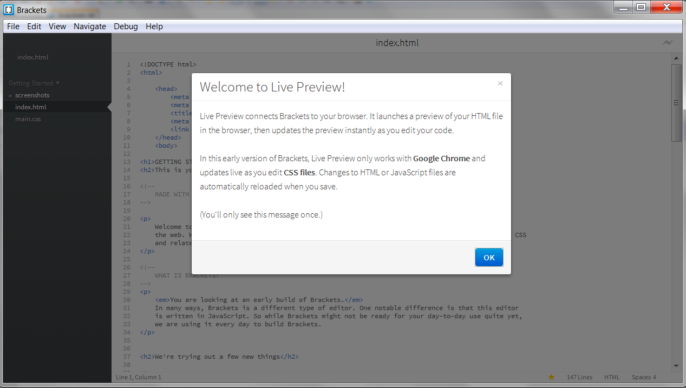
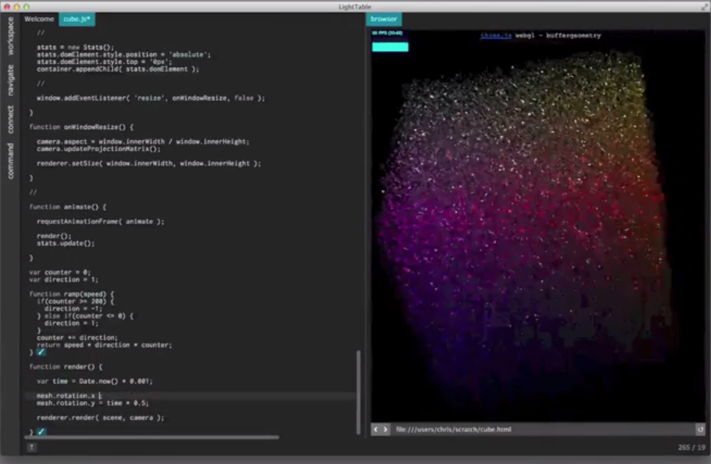
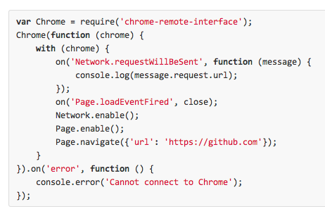
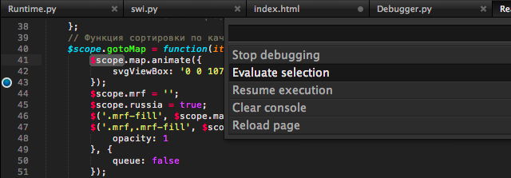
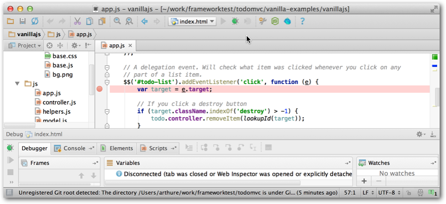

{{+bindTo:partials.standard_devtools_article}}

# Showcase Chrome Debugging Protocol Clients

There are a number third-party clients for the Chrome debugging protocol. This section presents a sample.

## Brackets

Brackets is a web-based IDE that uses the Chrome debugging protocol to enable 
debugging and live HTML/CSS development. 
 
 
* [Brackets site](http://brackets.io/). Download from [download.brackets.io](http://download.brackets.io/). Source code available on [GitHub](https://github.com/adobe/brackets).
* This [blog post from Mark 
  DuBois](http://www.markdubois.info/weblog/2013/03/adobe-brackets-revisited/) 
  gives an overview of working in Brackets.

## Light Table

Light Table is a new IDE that takes a novel approach to arranging the 
developer's workspace. Light Table is currently in alpha. It's not open source, 
but the alpha version is available for free at this time.

 

* Download from the [official site.](http://www.lighttable.com/)
* Read the [blog post](http://www.chris-granger.com/2013/04/28/light-table-040/) 
  describing new features in 0.4.0, including DevTools integration.

## NodeJS

A number of modules have been developed to make use of the Chrome debugger from 
Node scripts. 

### chrome-remote-interface

The [`chrome-remote-interface` module](https://github.com/cyrus-and/chrome-remote-interface) wraps the debugger protocol with a Node-style 
JavaScript API.

        npm install -g chrome-remote-interface

 

Take a look at [which NPM projects use chrome-remote-interface](https://www.npmjs.com/browse/depended/chrome-remote-interface).

### crconsole

The [`crconsole` module](https://github.com/sidorares/crconsole) provides a command-line interface to the Chrome console. It uses the `chrome-remote-interface` module to communicate with the Chrome debugger 
protocol.

### automated-chrome-profiling

A basic [recipe for automating JS profiling through Node.js](https://github.com/paulirish/automated-chrome-profiling#readme). See the [other apps mentioned](https://github.com/paulirish/automated-chrome-profiling/blob/master/readme.md#way-more-is-possible) that live in the protocol ecosystem.

## Sublime Text

The Sublime Web Inspector project adds Chrome debugger integration to the 
popular Sublime Text editor. You can install it from the Sublime Text package 
manager.

 

* See the [official page](http://sokolovstas.github.io/SublimeWebInspector/) for 
  an overview and installation instructions.
* Source code available on 
  [GitHub](https://github.com/sokolovstas/SublimeWebInspector).

## Telemetry

Telemetry is a performance testing framework used by the Chromium project to 
test multiple versions of the Chrome browser. It uses the debugging protocol to 
remotely control instances of Chrome.

* [Introduction to Telemetry on Chromium.org.](http://www.chromium.org/developers/telemetry)

## Vim

Chrome.vim is an experimental plugin for the Vim editor that provides some basic 
Chrome operations as Vim commands.

* [vim-chrome on Github](https://github.com/mklabs/vimfiles/tree/master/custom-bundle/vim-chrome) 

## WebDriver

The Selenium browser automation tools use WebDriver API to abstract interactions 
with different browsers. The WebDriver implementation for Chrome uses the Chrome 
debugging protocol.

* [Selenium WebDriver project](http://docs.seleniumhq.org/projects/webdriver/) 

## WebStorm

WebStorm is a commercial IDE that supports debugging and live-editing in Chrome. 
WebStorm uses a [Chrome extension 
](http://www.jetbrains.com/webstorm/webhelp/using-jetbrains-chrome-extension.html)to 
integrate with the Chrome debugger.

 

* Download from [JetBrains](http://www.jetbrains.com/webstorm/).
* [Screencast describing the latest debugging 
  features.](http://tv.jetbrains.net/videocontent/improved-javascript-debugger-in-webstorm-7)

## Python

[chrome_remote_shell](https://github.com/minektur/chrome_remote_shell) provides a nice API layer for python apps.
{{/partials.standard_devtools_article}}
