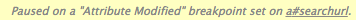
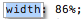

Project: /chrome-developer-tools/_project.yaml
Book: /chrome-developer-tools/_book.yaml

[[TOC]]

# Introduction

The **Elements panel** lets you view structured information about the current page. In today’s applications, the HTML markup served on an initial page load is not necessarily what you’ll see in the Document Object Model ([DOM](http://docs.webplatform.org/wiki/dom)) tree. Having a real-time representation of the page can be a powerful tool when debugging and authoring web pages.

You can use the Elements panel for a variety of tasks:

* Inspect the HTML & CSS of a web page.

* Test different layouts.

* Live-edit CSS.

To make better use of screen real estate, you may find it convenient to follow these workspace tips:

* **Collapse** any panes you are not actively using.

* **Resize the divider** between the DOM tree and the sidebar containing the panes.

	<animation class="devtools-animation" class="devtools-animation" src="event-listener-resize" speed="1800" repeatdelay="2"></animation>

# DOM

The DOM tree view displays the DOM structure of the current web page. The DOM tree is a tree of DOM nodes that represent individual HTML elements, such as `<body>` and `
`. For ease of reading, the DOM tree view displays the HTML element tags instead of the DOM node types: for example, `
` instead of HTMLParagraphElement.

The DOM tree view shows the current state of the tree. This may not match the HTML that was originally loaded for a number of reasons:

* You can modify the DOM tree using JavaScript.

* The browser engine can try to correct invalid author markup and produce an unexpected DOM tree.

## Inspecting elements

	<animation class="devtools-animation" src="inspect-element" speed="1200" repeatdelay="2"></animation>

Inspecting an element shows you the DOM nodes and CSS responsible for a rendered element in the browser.

	<animation class="devtools-animation" src="console-inspect" speed="1800" repeatdelay="2"></animation>

There are several ways to inspect an element:

* Right-click any element on the page the page and select **Inspect Element**.

* Press **Control+Shift+C** (or **Command****+Shift+C **on mac**)** to open DevTools in Inspect Element mode, then click on an element.

* Click **Inspect Element**  at the bottom of the DevTools window to go into Inspect Element Mode, then click on an element.

* Use the `inspect()` method in the console, such as `inspect(document.body)`. See the [Command-Line API](https://developers.google.com/chrome-developer-tools/docs/commandline-api) for information on using inspect).

	<animation class="devtools-animation" src="right-click-inspect-element" speed="800" repeatdelay="2"></animation>

## Navigate the DOM with a mouse or keyboard

You can navigate through the DOM structure using either mouse or keyboard.

* To expand a collapsed node , double-click the node or press **Right arrow**.

* To collapse an expanded node , double-click the node or press **Left arrow**.

Expanding a node automatically selects its first child, so you can expand a deeply-nested structure by pressing **Right arrow** repeatedly.

	<animation class="devtools-animation" src="navigating-dom" speed="1200" repeatdelay="2"></animation>

As you navigate, the Elements panel shows a breadcrumb trail in the bottom bar: 

The currently selected node is highlighted in blue. Navigating down the structure extends the trail:

Navigating back up the structure moves the highlight:

DevTools displays as many items as possible in the trail.

If the entire trail doesn't fit in the status bar, an ellipsis (...) shows where the trail has been truncated. Click the ellipsis to show the hidden elements.

For a complete list of keyboard shortcuts, see: https://developers.google.com/chrome-developer-tools/docs/shortcuts

## Editing DOM nodes and attributes

The Elements panel lets you modify the DOM:

* Edit a DOM node as HTML.

* Add and remove individual DOM nodes.

* Edit attribute names and values.

* Move DOM elements

Updating the in-memory DOM tree **doesn't** modify the source files. Reloading the page erases any DOM tree modifications.

### Editing DOM nodes

For DOM nodes, double click the opening **Element tag **(`h2, section, img`). The field is now editable and can be renamed, the closing tag is automatically updated after renaming.

 

	<animation class="devtools-animation" class="devtools-animation" src="edit-element-name" speed="1800" repeatdelay="2"></animation>

### Editing attributes

For DOM attributes, DevTools differentiates between the attribute name and value, click on either of these respective portions to make them editable.

* Double click the attribute name  to edit it independently of the attribute value.

* Double click the attribute value  to edit this portion independently of the attribute name.

When edit mode is active,** **cycle through attribute values by pressing **Tab.** Once you reach the last attribute value, pressing tab again creates a new attribute field.

Using **Tab** is not the only way to add and edit attributes, since it’s a common pattern, there are dedicated items for it in the DOM node context menu titled **Add Attribute** and **Edit Attribute**.

* Select **Add Attribute** to create a new field at the end of the opening tag.

* Select **Edit Attribute** to modify an existing attribute. This action is context-sensitive, the portion you Right-click on determines the editable portion of the node.

### Editing DOM nodes as HTML

To edit a DOM node and its children as HTML:

1. Right-click on the node and choose **Edit as HTML **(On Windows, press **F2** to toggle editing mode on the currently selected node.).

Use the editable field to make your changes.

2. Click outside the editable field to update the DOM.

Press **Esc** to stop editing without modifying the DOM.

	<animation class="devtools-animation" src="tab-switch-html-attr" speed="2000" repeatdelay="2"></animation>

## Moving elements

You can rearrange the DOM tree in the Elements panel to test out different arrangements for the page. 

Drag a node within the Elements panel to move it to a new position in the DOM tree.

	<animation class="devtools-animation" src="rearrange-nodes" speed="2000" repeatdelay="2"></animation>

## Deleting elements

Remove DOM nodes by using any of the following techniques:

* Right-click on the node and select **Delete Node.**

* Select the node and press **Delete**.

You can also remove an element by deleting its tag when using **Edit as HTML**.

If you delete a node by accident, use **Control+Z **(or** Command+Z** on Mac)** **to undo your last action.

## Scrolling into view

When you hover over or select a DOM node, the rendered element is highlighted in the main browser window. If the element is scrolled offscreen, a tooltip is displayed at the edge of the browser window indicating that the selected element is offscreen.

To scroll the page so the element appears in the viewport, Right-click the element and select **Scroll into View**.

	<animation class="devtools-animation" class="devtools-animation"  src="scroll-into-view" speed="2000" repeatdelay="2"></animation>

## Setting DOM breakpoints

A DOM breakpoint is similar to a breakpoint in the Sources panel. It's used to pause execution of the running JavaScript under certain conditions. A JavaScript breakpoint is associated with a specific line of a JavaScript file, and is triggered when the line is reached. A DOM breakpoint is associated with a specific DOM element, and is triggered when the element is modified in some way.

You can use a DOM breakpoint to debug complex JavaScript applications, when you're not sure what part of the JavaScript is updating a given element.

For example, if your JavaScript is changing the styling of a DOM element, you can set a DOM breakpoint to fire when the element's attributes are modified.

**Subtree Modifications**

A subtree modification breakpoint is triggered when a child element is added, removed, or moved. For example, if you set a subtree modification breakpoint on the 'main-content' element, the following code triggers the breakpoint:

`var element = document.getElementById('main-content');`

`//modify the element's subtree`

`var mySpan = document.createElement('span');`

`element.appendChild( mySpan );`

**Attributes Modifications**

An attribute modification occurs when the attribute of an element (`class, id, name`) is changed dynamically:

`var element = document.getElementById('main-content');`

`// class attribute of element has been modified`

`element.className = ‘active’; `

**Node Removal**

A node removal modification is triggered when the node in question is removed from the DOM:

`document.getElementById('main-content').remove();`

	<animation class="devtools-animation" class="devtools-animation" src="dom-breakpoint" speed="1000" repeatdelay="2"></animation>

In the animation above, the following steps occur:

1. User types in the search box, and the search box changes size.

2. User sets an attribute modification breakpoint on the search box. 

3. User types in the search box, triggering the breakpoint and pausing execution.

4. User hovers over a JavaScript variable, displaying a popover with more details.

The Elements and Sources panels both include a pane for managing your DOM Breakpoints. 

To see all of your DOM breakpoints, click the expander arrow next to DOM Breakpoints to show the pane. Each breakpoint is listed with an element identifier and the breakpoint type.

You can interact with each listed breakpoint in any of the following ways:

* **Hover **over the element identifier to show the element's corresponding position on the page (similar to hovering over nodes in the Elements panel).

* **Click** an element to jump to its location in the Elements panel.

* **Toggle **the **checkbox **to enable or disable the breakpoint.

When you trigger a DOM breakpoint, the breakpoint is highlighted in the DOM Breakpoints pane. The **Call Stack** pane displays the **reason** for a debugger pause:

## Viewing element event listeners

View JavaScript event listeners associated with a DOM node in the **Event Listeners** pane.

The top-level items in the Event Listeners pane show the event types that have registered listeners.

Click the expander arrow next to the event type (for example `click`) to see a list of registered event handlers. Each handler is identified by a CSS-selector like element identifier, such as "`document`" or "`button#call-to-action`". If more than one handler is registered for the same element, the element is listed repeatedly.

	<animation class="devtools-animation" class="devtools-animation" src="element-event-listener" speed="1800" repeatdelay="2"></animation>

Click the expander arrow next to an element identifier to see the properties of the event handler.

The Event Listeners pane lists the following properties for each listener:

* **handler: **Contains a callback function. Right-click on the function and select **Show Function Definition** to view where the function is defined (if source code is available).

* **isAttribute: **True if the event is registered through a DOM attribute (for example, `onclick`).

* **lineNumber:** Line number containing the event registration.

* **listenerBody:** String representation of the callback function.

* **node:** The DOM node that the listener is registered on. Hover over the node to reveal its position in the page viewport.

* **sourceName:** URL Path to the source file containing the event listener.

* **type:** Type of event being listened for (for example, `click`).

* **useCapture****:** A boolean value stating whether the [useCapture](https://developer.mozilla.org/en-US/docs/Web/API/EventTarget.addEventListener) flag on `addEventListener` was set.

By default, registered event handlers display for the following types of elements:

* The currently selected element.

* Ancestors of the currently selected element.

If you find it excessive to view all event handlers, including those registered using event delegation, click **Filter**** ** and select the menu item **Selected Node Only** which limits displayed event listeners to only those registered directly on the element.

**Note: **Many Chrome extensions add their own event listeners onto the DOM.

If you see a number of event listeners that aren't set by your code, you may want to reopen your page in an Incognito window. Incognito windows prevent extensions from running by default.

# Styles

CSS defines the presentation layer of your page. You can view and modify any CSS declaration which affects an element on the current page. An understanding of the cascade (in Cascading Style Sheets) and inheritance aids a development and debugging workflow:

* The cascade relates to how CSS declarations are given weights to determine which rules should take precedence when they overlap with another rule.

* Inheritance relates to how HTML elements inherit CSS properties from their containing elements (ancestors).

See the W3C documentation on cascading and inheritance for more information: [http://www.w3.org/TR/CSS2/cascade.html](http://www.w3.org/TR/CSS2/cascade.html)

## Styles Pane

The Styles pane shows the CSS rules that apply to the selected element, from highest priority to lowest:

* Element styles applied directly to the element using the style property (or applied in DevTools).

* Matched CSS rules include any rules matched by the element. For example, the CSS selector `span` matches an HTML `` element. 

* Inherited styles include any inheritable style rules that match the selected element's ancestors.

The labels on the image above correspond with the numbered items below.

1. Styles associated with a selector that matches the element.

2. **Cascade** rules dictate that if two rules have the same origin, weight, and specificity, the last defined rule takes precedence. In this case, the second color property takes precedence. The first color property is shown in strikethrough text to show that it's been overridden.

3. [User agent stylesheets](http://meiert.com/en/blog/20070922/user-agent-style-sheets/) are clearly labelled, and are often overridden by the CSS on your web page.

4. The **cascade** dictates that author styles have more weight than user agent styles, so the user-defined style of `display: inline-block;` overrides the user-agent defined style of `display: block`.

5. **I****nherited**** **styles are displayed as a group under the "Inherited from [node]" header. Click the DOM node in the header to navigate to its position in the DOM tree view. (The [CSS 2.1 properties table](http://www.w3.org/TR/CSS21/propidx.html) shows which properties are inheritable.)

6. The selector `:root body` has a higher **specificity** than just `body`, therefore its style declarations take precedence.

7. `font-family `on the body is **overridden**. It is also a similar case for the `font-size` property (overridden due to [selector specificity](http://www.w3.org/TR/css3-selectors/#specificity))

Comma separated selectors are colored differently depending on whether or not they match the selected DOM node.

Greyed out selectors like `audio` and `video` do not apply to the selected node. The rules shown above corresponds to the following CSS source:

`video, audio, div, .message, body *, time {`

`  /* visibility: hidden */`

`  margin-top: 10px;`

`}`

Since the visibility declaration is commented out, the Styles pane shows it as disabled.

Use the shortcut **Control+Click **(or **Command+Click **on Mac) on CSS properties or property values from the styles pane to navigate to their position in the source code within the Sources panel.

### Edit and create styles

You can add or edit styles within the **Styles pane** in the Elements panel. Unless the area containing the styling information is greyed out (as is the case with user agent stylesheets), all styles are editable. Edit styles in the following ways:

* Edit an existing property name or value.

* Add a new property declaration.

* Add a new CSS rule.

To enable or disable a style declaration, check or uncheck the checkbox next to it

#### Edit an existing property name or value

Click a CSS property name to edit the name:

Click on a property value to edit the value. If you're editing a property name, press Tab or Enter to edit the property value.

By default, your CSS modifications are not permanent, changes are lost when you reload the page. To customise the behaviour, see [Workspaces](https://developers.google.com/chrome-developer-tools/docs/settings#workspace).

When editing a numeric CSS property value, you can increment and decrement numeric CSS property values using the following shortcuts:

* Press **Up** or **Down** to increment or decrement the value by 1 (or by .1 if the current value is between -1 and 1).

* Press **Alt+Up** or **Alt+Down** to increment or decrement the value by 0.1.

* Press **Shift+Up/Down** or **PageUp/PageDown **to increment or decrement the value by 10.

* Press **Shift+PageUp/PageDown **to increment or decrement the value by 100.

#### Add a new property declaration

Click an empty space within an editable CSS rule to create a new style. Edit mode now applies to the CSS property field, you can now enter a new property.

To add a new property and view code hints in the CSS property field, follow these steps:

1. Begin typing into the CSS property field. Suggestions display in a drop down box.

2. Press **Up **or **Down arrows **to focus on a suggestion.

3. Accept a suggestion using **Tab**, **Right** **arrow** or **Enter**.

After you have selected a valid CSS property, bring up suggestions for applicable CSS values by moving focus to the CSS property value field. For example, the property `display` suggests values such as `block, flex, none,` and others.

Paste CSS into the Styles pane using **Control+V** (or **Command+V **on Mac). Properties and their values are parsed and entered into the correct fields.

#### Add a style rule

You may find it preferable to add styles along with a **new selector**. Click **New Style Rule**  within the styles pane header bar to generate a new CSS rule.

	<animation class="devtools-animation" src="new-style-rule" speed="2000" repeatdelay="2"></animation>

#### Trigger pseudo-classes on element

You can provide dynamic styling for your UI elements using pseudo-class selectors such as :hover. However, these dynamic states can be hard to debug. So DevTools lets you manually set pseudo-classes on individual elements. 

	<animation class="devtools-animation" src="pseudo-triggers" speed="2000" repeatdelay="2"></animation>

You may trigger any combination of the following four pseudo-classes:

* **:active** - Applies to a link in the process of activation (for example, upon click).

* **:hover** - Applies to an element while a mouse cursor is over it.

* **:focus** - Applies to an element which gains focus (for example, through pressing **Tab**).

* **:visited** - Applies to a link previously visited in the browser.

To set an element's state:

* Click **Toggle Element State** next to **New Style Rule** within the styles pane header.

* Right-click a DOM node in the Elements panel and select **Force Element State.**

### Change history (Local modifications)

Local modifications contain independent changes made to source files such as JavaScript and CSS. 

Locate the local modifications pane using the following steps:

1. Open the **Sources **panel**.**

2. Right-click (or Control-Click on Mac) on a source file in the sidebar.

3. Select **Local modifications**.

	<animation class="devtools-animation" src="revisions" speed="2000" repeatdelay="2"></animation>

To create modifications, edit source code through the editor in the Sources panel.

Make a modification to a CSS rule which originates from an external style sheet and notice the change shows in the local modifications pane.

**Note**: When you create a new rule using New Style Rule , the new rule doesn't belong to an existing stylesheet. DevTools adds it to a special inspector stylesheet. The inspector stylesheet can be edited in the Sources panel, like other files.

Explore the local modifications pane:

* Expand top-level file names to view the time  a modification occurred.

* Expand second-level items to view a [diff](http://en.wikipedia.org/wiki/Diff) (before and after) corresponding to the modification. A line with a pink background signifies a removal while a line with a green background signifies an addition.

* Select **revert** next to a file name to undo all local modifications against that file.

	<animation class="devtools-animation" src="revision-apply-original" speed="2000" repeatdelay="2"></animation>

You can also use **Control+Z** (or **Command+Z** on Mac) to quickly undo minor changes to the DOM or Styles via the Elements panel.

## Metrics pane

The metrics pane provides a visual illustration of how styles affect the [CSS Box Model](https://developer.mozilla.org/en-US/docs/Web/CSS/box_model).

	<animation class="devtools-animation" src="metrics-pane" speed="1200" repeatdelay="2"></animation>

The Metrics pane shows a set of rectangles representing the box dimensions in the CSS box model. The inner, content box shows the dimensions of the content area. Outer boxes, such as the border box, show the values for each of the edges: border-top, border-right, border-bottom, and border-left.

If no value is set for a given edge, a dash is displayed in place of the value

**Note: **If you provide a value of anything other than `static` to the CSS [position](https://developer.mozilla.org/en-US/docs/Web/CSS/position) property, the metrics pane displays a box labelled **position**.

**Boxes** which may be displayed (from the outside in):

* position

* margin

* border

* padding

* *Content box* (no label as it is the innermost edge)

Interact with the metrics pane using these techniques:

* Hover over a box to highlight the corresponding area in the main browser window.

* Edit a field within a box (a field with no value displays a dash), the change is reflected in the `element.style` section.

