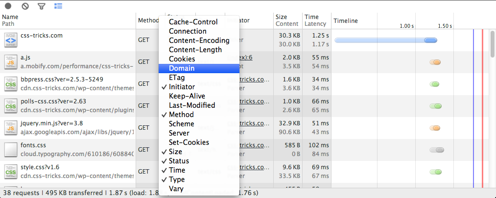
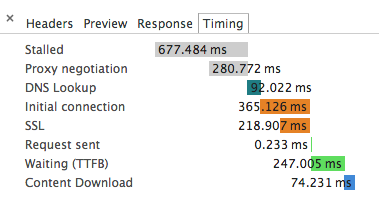

{{+bindTo:partials.standard_devtools_article canonical:strings.canonicalDevToolsNetwork}}

  <strong style="font-weight: normal; font-size: 110%; display:block;">The DevTools docs have moved!</strong>
  <a href="https://developers.google.com/web/tools/profile-performance/network-performance/resource-loading">Read the latest version</a> of this article and <a href="https://developers.google.com/web/tools/chrome-devtools">head over to the new home of Chrome DevTools</a> for the latest tutorials, docs and updates.

# Evaluating network performance

The Network panel records information about each network operation in your application, including detailed timing data, HTTP request and response headers, cookies, WebSocket data, and more. The Network panel helps you answer questions about the network performance of your web application, such as:

* Which resource had the slowest time to first byte?
* Which resources took the longest time to load (duration)?
* Who initiated a particular network request?
* How much time was spent in the various network phases for a particular resource?

## About the Resource Timing API

The Network panel uses the [Resource Timing API](http://www.w3.org/TR/resource-timing), a JavaScript API that provides detailed network timing data for each loaded resource. For example, the API can tell you precisely when the HTTP request for an image started, and when the image's final byte was received. The following illustration shows the network timing data points that the Resource Timing API provides.

The API is available to any web page, not just DevTools. In Chrome, it's exposed as methods on the global `window.performance` object. The `performance.getEntries()` method returns an array of "resource timing objects", one for each requested resource on the page.

Try this: open the JavaScript console on the current page, enter the following at the prompt, and hit Return:

    window.performance.getEntries()[0]

This evaluates the first element in the array of resource timing objects and displays its properties in the console, as shown below.

Each timestamp is in microseconds, following the [High Resolution
Time](http://www.w3.org/TR/hr-time/#sec-high-resolution-time) specification. This API is [available in
Chrome](http://updates.html5rocks.com/2012/08/When-milliseconds-are-not-enough-performance-now) as the `window.performance.now()` method.

## Network panel overview

The Network panel automatically records all network activity while DevTools is open. The first time you open the panel it may be empty. Reload the page to start recording, or simply wait for network activity to occur in your application.

Each requested resource is added as a row to the Network table, which contains the columns listed below. Note the following about the Network table:

* Not all columns listed below are visible by default; you can easily [show or hide columns](#adding-and-removing-table-columns).
* Some columns contain a primary field and a secondary field (**Time** and **Latency**, for example). When viewing the Network table with [large resource rows](#changing-resource-row-sizes) both fields are shown; when using small resource rows only the primary field is shown.
* You can [sort](#sorting-and-filtering) the table by a column's value by clicking the column header. The [the Timeline column](#timeline-view) behaves a bit differently: clicking its column header displays a menu of additional sort fields. See [Waterfall view](#timeline-view) and [Sorting and filtering](#sorting-and-filtering) for more information.

<dl class="nice">
  <dt>Name and Path</dt>
  <dd>The name and URL path of the resource, respectively.</dd>

  <dt>Method</dt>
  <dd>The HTTP method used for the request. For example: GET or POST.</dd>

  <dt>Status and Text</dt>
  <dd>The HTTP status code and text message.</dd>

  <dt>Domain</dt>
  <dd>The domain of the resource request.</dd>

  <dt>Type</dt>
  <dd>The MIME type of the requested resource.</dd>

  <dt>Initiator</dt>
  <dd>
    The object or process that initiated the request. It can have one of the following values:
    <dl class="nice">
      <dt>Parser</dt>
      <dd>Chrome's HTML parser initiated the request.</dd>
      <dt>Redirect</dt>
      <dd>A HTTP redirect initiated the request.</dd>
      <dt>Script</dt>
      <dd>A script initiated the request.</dd>
      <dt>Other</dt>
      <dd>Some other process or action initiated the request, such as the user navigating to a page via a link, or by entering a URL in the address bar.</dd>
    </dl>
  </dd>

  <dt>Cookies</dt>
  <dd>The number of cookies transferred in the request. These correspond to the cookies shown in the <a href="#cookies">Cookies tab</a> when viewing details for a given resource.</dd>

  <dt>Set-Cookies</dt>
  <dd>The number of cookies set in the HTTP request.</dd>

  <dt>Size and Content</dt>
  <dd>
    Size is the combined size of the response headers (usually a few hundred bytes) plus the response body, as delivered by the server.
    Content is the size of the resource's decoded content.
    If the resource was loaded from the browser's cache rather than over the network, this field will contain the text (from cache).
  </dd>

  <dt>Time and Latency</dt>
  <dd>
    Time is total duration, from the start of the request to the receipt of the final byte in the response.
    Latency is the time to load the first byte in the response.
  </dd>

  <dt>Timeline</dt>
  <dd>
    The Timeline column displays a <a href="#timeline-view">visual waterfall</a> of all network requests.
    Clicking the header of this column reveals a menu of additional <a href="#sorting-and-filtering">sorting fields</a>.
  </dd>
</dl>

### Preserving the network log upon navigation

By default, the current network record log is discarded when you navigate to another page, or reload the current page. To preserve the recording log in these scenarios, click the black **Preserve log upon navigation** button  at the bottom of the Network panel; new records are appended to the bottom of the table. Click the same button again (now red ) to disable log preservation.

### Sorting and filtering ###

By default, resources in the Network table are sorted by the start time of each request (the network "waterfall"). You can sort the table by another column value by clicking the column header. Click the header again to change the sort order (ascending or descending).

The Timeline column is unique from the others in that, when clicked, it displays a menu of additional sort fields.

The menu contains the following sorting options:

* **Timeline** — Sorts by the start time of each network request. This is the default sort, and is the same as sorting by the Start Time option).
* **Start Time** — Sorts by the start time of each network request (same as sorting by the Timeline option).
* **Response Time** — Sorts by each request's response time.
* **End Time** — Sorts by the time when each request completed.
* **Duration** — Sorts by the total time of each request.
* **Latency** — Sorts by the time between the start of the request and the beginning of the response (also known as the "time to first byte").

To filter the Network table to only show certain types of resources, click one of the content types along the bottom of the panel: **Documents**, **Stylesheets**, **Images**, **Scripts**, **XHR**, **Fonts**, **WebSockets**, and **Other**. In the following screenshot only CSS resources are shown. To view all content types, click the **All** filter button.

<h4 id="advanced-filtering">Advanced filtering</h4>

In addition to resource type filtering, you can narrow down resources by filter queries. For example, to find **all resources** which have a status code of `200`, you can enter the query `StatusCode:200` in the filter input field.

Take note of the following behaviour:
* A filter query includes a **type** (`StatusCode`) and **value** (`200`).
* A filter query is case insensitive, so you can type uppercase or lowercase.
* The filter type gives you autocomplete suggestions. Use the arrows keys to form a selection and press Tab to select it.
* The filter value has autocomplete which shows you values **present** in the current network recording.
* Quickly preview the results of your query, use the Up / Down arrow keys to cycle through the autocomplete suggestions. The results appear immediately even you do not press enter or tab to complete the selection.
* To negate a filter query, prepend the query with a dash (`-`), for example <code class="negate-example">-StatusCode:200</code>.

Available filter types:

<dl class="nice">
  <dt><strong>domain</strong></dt>
  <dd>The <strong>domain</strong> portion from the URL of the resource. E.g. <code>www.google-analytics.com</code>.</dd>

  <dt><strong>has-response-header</strong></dt>
  <dd>Checks the resource has a response header, regardless of the value. E.g. <code>Access-Control-Allow-Origin</code>.</dd>

  <dt><strong>is</strong></dt>
  <dd>Shows requests running at the current point in time. Current available value: <code>running</code></dd>

  <dt><strong>larger-than</strong></dt>
  <dd>Shows requests with a transfer size larger than the specified amount. Units assumed in bytes, but kilobyte (<code>k</code>) & megabyte (<code>m</code>) units also allowed: E.g. <code>larger-than:50</code>, <code>larger-than:150k</code>, <code>larger-than:2m</code> </dd>

  <dt><strong>method</strong></dt>
  <dd>The HTTP method used. E.g. <code>GET</code>.</dd>

  <dt><strong>mime-type</strong></dt>
  <dd>Also known as <code>Content-type</code> - the identifier for the type of resource. E.g. <code>text/html</code>.</dd>

  <dt><strong>scheme</strong></dt>
  <dd>The scheme portion in a URL. E.g. <code>https</code>.</dd>

  <dt><strong>set-cookie-name</strong></dt>
  <dd>The name of the cookie as set by the server. E.g. <code>loggedIn</code> (assuming a cookie like <code>loggedIn=true</code>).</dd>

  <dt><strong>set-cookie-value</strong></dt>
  <dd>The value of the cookie set by the server. E.g. <code>true</code> (assuming a cookie like <code>loggedIn=true</code>).</dd>

  <dt><strong>set-cookie-domain</strong></dt>
  <dd>The domain of the cookie as set by the server. E.g. <code>foo.com</code> (assuming a cookie like <code>loggedIn=true; Domain=foo.com; Path=/; Expires=Wed, 13 Jan 2021 22:23:01 GMT; HttpOnly</code>).</dd>

  <dt><strong>status-code</strong></dt>
  <dd>The status code in the HTTP response. E.g. <code>200</code>.</dd>
</dl>

To use a query shown in the above list, construct it in the format of: `<Filter Type>:<Description>`. You will almost always want to use the autocomplete suggestions which ensures your query is valid.

### Adding and removing table columns

You can change the default set of columns displayed by the Network table. To show or hide a column, Right+click or Control+click (Mac only) in the table header and select or deselect column names from the list.

### Changing resource row sizes

You can view the Network table with large resource rows (the default), or small resource rows. Click the blue **Use small resource rows** toggle button  at the bottom of the panel to view small rows. Click the same button (now gray ) to view large resource rows again. Large rows enable some columns to display two text fields: a primary field and a secondary field (Time and Latency, for instance). When viewing small rows only the primary field is displayed.

<figure>
  
  <figcaption>
    The network table with small resource rows and just the timeline column.
  </figcaption>
</figure>

### Waterfall view

The waterfall view in the network panel graphs the time it took to load each resource.
From the start of the HTTP request to the receipt of the final byte of the response.

Each resource loading time is represented as a bar.
This has color-coded information related to each resource.
Each color specifies a different step needed to recieve the resource.
The larger the bar grows represents more data being trasmitted for the request.

<figure>
  
  <figcaption>
    The network timeline for a simple web page.
  </figcaption>
</figure>

Hovering your mouse over the bar itself will present the complete timing data.
This is the same information that's presented in the [Timing details tab](#resource-network-timing) for a given resource.

<figure>
  
  <figcaption>
    Network timing details revealed on hover.
  </figcaption>
</figure>

The waterfall highlights [`DOMContentLoaded`](http://docs.webplatform.org/wiki/dom/events/DOMContentLoaded) and [`load`](http://docs.webplatform.org/wiki/dom/events/load) events display with blue and red vertical lines. When the engine has completed parsing of the main document the `DOMContentLoaded` event fires. Upon retrieving all the page's resources the `load` event will fire.

<figure>
  
  <figcaption>
    The event lines as displayed over the timeline.
  </figcaption>
</figure>

You may enable in the network settings to view the timeline as color-coded by resource type.
If you do the network timing information is still accessible through the tooltip.
Waterfall bars are color-coded as follows:

<!-- TODO: Fix formatting of cells -->
<table id="colortable">
<tr>
<td class="doc"></td>
<td>Documents</td>
</tr>
<tr>
<td class="css"></td>
<td>Stylesheets</td>
</tr>
<tr>
<td class="images"></td>
<td>Images</td>
</tr>
<tr>
<td class="scripts"></td>
<td>Scripts</td>
</tr>
<tr>
<td class="xhr"></td>
<td>XHR</td>
</tr>
<tr>
<td class="fonts"></td>
<td>Fonts</td>
</tr>
<tr>
<td class="other"></td>
<td>Other</td>
</tr>
</table>

### Saving and copying network information ##

Right-clicking or Ctrl + Click (Mac only) within the Network table a context menu appears with several actions. Some of these actions apply to the resource row under the mouse click (like [copying HTTP request headers](#copying_requests_as_curl_commands)), while others apply to the entire network recording (such as [saving a Network recording as a HAR file](#saving_network_data)).

The following menu actions apply to the selected resource:

* **Open Link in New Tab** — Opens the resource in a new tab. You can also double-click the resource name in the Network table.
* **Copy Link Address** — Copies the resource URL to the system clipboard.
* **Copy Request Headers** — Copies the HTTP request headers to the system clipboard.
* **Copy Response Headers** — Copies the HTTP response headers to the system clipboard.
* **Copy as cURL** — Copies the network request as a
  [cURL](http://curl.haxx.se/) command string to the system clipboard. See [Copying requests as cURL commands](#copying-requests-as-curl-commands).
* **Replay XHR** — If the associated request is an XMLHTTPRequest, re-sends the original XHR.

#### Copying requests as cURL commands

[cURL](http://curl.haxx.se/) is a command line tool for making HTTP transactions. The Network panel's **Copy as cURL** command recreates an HTTP request (including HTTP headers, SSL certificates, and query string parameters) and copies it as a cURL command string to the clipboard. You can then paste the string into a terminal window (on a system with cURL) to execute the same request.

Below is an example cURL command line string taken from a XHR request on the Google News home page.

    curl 'http://news.google.com/news/xhrd=us' -H 'Accept-Encoding: gzip,deflate,:sdch' -H 'Host: news.google.com' -H 'Accept-Language: en-US,en;q=0.8' -H 'User-Agent: Mozilla/5.0 (Macintosh; Intel Mac OS X 10_8_3) AppleWebKit/537.36 (KHTML, like Gecko) Chrome/29.0.1510.0 Safari/537.36' -H 'Accept: */*' -H 'Referer: http://news.google.com/nwshp?hl=en&tab=wn' -H 'Cookie: NID=67=eruHSUtoIQA-HldQn7U7G5meGuvZOcY32ixQktdgU1qSz7StUDIjC_Knit2xEcWRa-e8CuvmADminmn6h2_IRpk9rWgWMdRj4np3-DM_ssgfeshItriiKsiEXJVfra4n; PREF=ID=a38f960566524d92:U=af866b8c07132db6:FF=0:TM=1369068317:LM=1369068321:S=vVkfXySFmOcAom1K' -H 'Connection: keep-alive' --compressed

#### Saving network data

You can save the data from a network recording as a HAR ([HTTP Archive](http://www.softwareishard.com/blog/har-12-spec/)) file, or copy the records as a HAR data structure to your clipboard. A HAR file contains a JSON data structure that describes the network "waterfall". Several [third-party](http://ericduran.github.io/chromeHAR/) [tools](https://code.google.com/p/harviewer/) can reconstruct the network waterfall from the data in the HAR file.

**To save a recording:**

1. Right+click or Control+click on the Network table.
2. In the context menu that appears, choose one of the following actions:
    * **Copy All as HAR** — Copies the network recording to the system clipboard in the HAR format.
    * **Save as HAR with Content** — Saves all network data to a HAR file along with each page resource. Binary resources, including images, are encoded as Base64-encoded text.

For more information, [Web Performance Power Tool: HTTP Archive (HAR)](http://www.igvita.com/2012/08/28/web-performance-power-tool-http-archive-har/).

## Network resource details #

When you click a resource name in the Network table a tabbed window appears that contains the following additional details:

* [HTTP request and response headers](#http-headers)
* [Resource preview](#resource-previews)
* [HTTP response](#http-response)
* [Cookie names and values](#cookies)
* [WebSocket messages](#websocket-frames)
* [Resource network timing](#resource-network-timing)

### HTTP headers

The Headers tab displays the resource's request URL, HTTP method, and response status code. Additionally, it lists the HTTP response and request headers and their values, and any query string parameters. You can view HTTP headers parsed and formatted, or in their source form by clicking the **View parsed**/**View source** toggle button, respectively, located next to each header's section. You can also view parameter values in their decoded or URL encoded forms by clicking the **View decoded**/**View URL encoded** toggle button next to each query string section.

You can also [copy request and response headers](#saving-network-data) to your clipboard.

### Resource previews

The Preview tab displays a preview of the resource, when available. Previews are currently displayed for image and JSON resources, as shown below.

You can view the resource's unformatted response on the [Response
tab](#http-response).

### HTTP response

The Response tab contains the resource's unformatted content. Below is a screenshot of a JSON data structure that was returned as the response for a request.

You can also [view formatted previews](#resource-previews) of some resource types, including JSON data structures and images.

### Cookies

The Cookies tab displays a table of all the cookies transmitted in the
resource's HTTP request and response headers. You can also clear all cookies.

The Cookies table contain the following columns:

<dl class="nice">
  <dt>Name</dt>
  <dd>The cookie's name.</dd>

  <dt>Value</dt>
  <dd>The value of the cookie.</dd>

  <dt>Domain</dt>
  <dd>The domain the cookie belongs to.</dd>

  <dt>Path</dt>
  <dd>The URL path the cookie came from.</dd>

  <dt>Expires / Max-Age</dt>
  <dd>The value of the cookie's expires or max-age properties.</dd>

  <dt>Size</dt>
  <dd>The size of the cookie in bytes.</dd>

  <dt>HTTP</dt>
  <dd>This indicates that the cookie should only be set by the browser in the HTTP request, and cannot be accessed with JavaScript.</dd>

  <dt>Secure</dt>
  <dd>The presence of this attribute indicates that the cookie should only be transmitted over a secure connection.</dd>
</dl>

### WebSocket frames

The Frames tab shows messages sent or received over a WebSocket connection. This tab is only visible when the selected resource initiated a WebSocket connection. The table contains the following columns:

<dl class="nice">
  <dt>Data</dt>
  <dd>
    The message payload.
    If the message is plain text, it's displayed here.
    For binary opcodes, this field displays the opcode's name and code.
    The following opcodes are supported:
    <ul>
      <li>Continuation Frame</li>
      <li>Binary Frame</li>
      <li>Connection Close Frame</li>
      <li>Ping Frame</li>
      <li>Pong Frame</li>
    </ul>
  </dd>

  <dt>Length</dt>
  <dd>The length of the message payload in bytes.</dd>

  <dt>Time</dt>
  <dd>The time stamp when the message was created.</dd>
</dl>

Messages are color-coded according to their type. Outgoing text messages are color-coded light-green; incoming text messages are white:

 

WebSocket opcodes are light-yellow:

 

Errors are light-red.

**Notes about current implementation:**

* To refresh the Frames table after new messages arrive, click the resource name on the left.
* Only the last 100 WebSocket messages are preserved by the Frames table.

### Resource network timing

The Timing tab graphs the time spent on the various network phases involved loading the resource. This is the same data displayed when you hover over a resource bar in the [waterfall view](#timeline-view).

<dl class="nice">
  <dt class="stalled"><strong>Stalled/Blocking</strong></dt>
  <dd>
    Time the request spent waiting before it could be sent.
    This time is inclusive of any time spent in proxy negotiation.
    Additionally, this time will include when the browser is waiting for an already established connection to become available for re-use, obeying Chrome's <a href="https://code.google.com/p/chromium/issues/detail?id=12066">maximum six</a> <abbr title="Transmission Control Protocol">TCP</abbr> connection per origin rule.
  </dd>

  <dt class="proxy-negotiation"><strong>Proxy Negotiation</strong></dt>
  <dd>Time spent negotiating with a proxy server connection.</dd>

  <dt class="dns-lookup"><strong><abbr title="Domain Name System">DNS</abbr> Lookup</strong></dt>
  <dd>
    Time spent performing the DNS lookup.
    Every new domain on a page requires a full roundtrip to do the DNS lookup.
  </dd>

  <dt class="initial-connection"><strong>Initial Connection / Connecting</strong></dt>
  <dd>Time it took to establish a connection, including <abbr title="Transmission Control Protocol">TCP</abbr> handshakes/retries and negotiating a <abbr title="Secure Sockets Layer">SSL</abbr>.</dd>

  <dt class="ssl"><strong>SSL</strong></dt>
  <dd>Time spent completing a SSL handshake.</dd>

  <dt class="request-sent"><strong>Request Sent / Sending</strong></dt>
  <dd>
    Time spent issuing the network request.
    Typically a fraction of a millisecond.
  </dd>

  <dt class="ttfb"><strong>Waiting (<abbr title="Time To First Byte">TTFB</abbr>)</strong></dt>
  <dd>
    Time spent waiting for the initial response, also known as the Time To First Byte.
    This time captures the latency of a round trip to the server in addition to the time spent waiting for the server to deliver the response.
  </dd>

  <dt class="content-download"><strong>Content Download / Downloading</strong></dt>
  <dd>Time spent receiving the response data.</dd>
</dl>

## Additional resources

To learn more optimizing the network performance of your application, see the following resources:

* Use [PageSpeed Insights](https://developers.google.com/speed/pagespeed/insights) to identify performance best practices that can be applied to your site, and [PageSpeed optimization tools](https://developers.google.com/speed/pagespeed/optimization) to automate the process of applying those best practices.
* [High Performance Networking in Google
  Chrome](http://www.igvita.com/posa/high-performance-networking-in-google-chrome/) discusses Chrome network internals and how you can take advantage of them to make your site faster.
* [How gzip compression works](https://developers.google.com/speed/articles/gzip) provides a high level overview gzip compression and why it's a good idea.
* [Web Performance Best Practices](https://developers.google.com/speed/docs/best-practices/rules_intro) provides additional tips for optimizing the network performance of your web page or application.

{{/partials.standard_devtools_article}}
